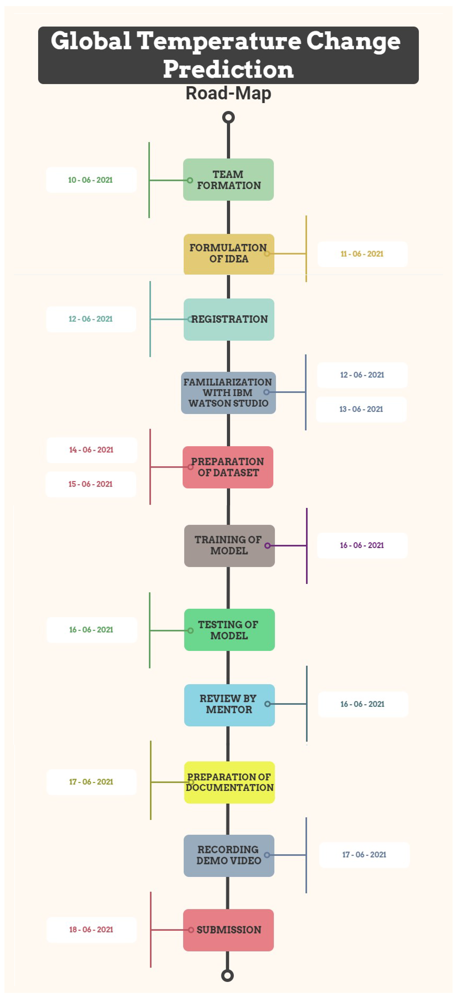

# Global-Temperature-Change-Prediction

Global climate change has already had observable effects on the environment. Glaciers have shrunk, ice on rivers and lakes is breaking up earlier, plant and animal ranges have shifted and trees are flowering sooner.

Effects that scientists had predicted in the past would result from global climate change are now occurring: loss of sea ice, accelerated sea level rise and longer, more intense heat waves.

According to the 2020 Global Climate Report from NOAA National Centers for Environmental Information, every month of 2020 except December was in the top four warmest on record for that month. In December, the presence of a moderately strong La Niña event cooled the tropical Pacific Ocean and dampened the global average warmth. The month turned out as "only" the eighth warmest December on record.

## Contents

- [Global-Temperature-Change-Prediction](#submission-or-project-name)
  - [Short Description](#short-description)
  - [Long Description](#long-description)
  - [Demo Video](#demo-video)
  - [Solution Roadmap](#solution-roadmap)
    - [Future Scope](#future-scope)
  - [Built with](#built-with)
  - [Version](#version)
  - [Authors](#authors)
  - [Acknowledgments](#acknowledgments)

## Short description
Predicting the temperature for next 10 years from the previous 116 years data using LSTM model (3 Layers)

## Long description

The phrase Sustainability is used to explain many distinctive strategies for enhancing our existence. The biggest threat to environmental sustainability is climate change. Climate movement gives a tremendous possibility to liberate large economic and social advantages that can assist us obtain the Sustainable Development Goals. SDG aims to “take immediate action to fight climate change and its impact”, while acknowledging that we are making a model to predict the Global Temperature with the aim that we can take the necessary precautions to minimize weather-associated risks.

 - We take the monthly temperature from 1880 to 2020 dataset. We then clean our dataset and add a column for average annual temperature for the said years.
 - We will then proceed by splitting the training and testing set in a 90:10 ratio.
 - We would need to create a collection of training data by which the x-values will be a 116-year windowed data and the corresponding y-value as the subsequent temperature change data in the next 10 years.
- We have :
  - LSTM : the 116 units represent the 116-year windowed datasets while the returned value specifies the input of the next layer.
  - Dropout(p=0.2): for regularizing effects and preventing the training set’s over-fitting.

- The model has been trained for 500 epochs. So we get the predicted temperature helping us to determine how the global temperature is going to change and what essential precautions or steps we should take to save the environment.

We are building a Global Temperature Prediction model which can efficiently estimate the average Global temperature of the next 10 years using 116-year participation records across the world. Although warming has no longer been uniform across the world, the upward fashion inside the globally averaged temperature shows that more regions are warming than cooling. However, the hypothesis of working with the global average temperature is convenient for monitoring the changes in Earth's energy. 
The Global Temperature Prediction model can determine that Earth’s global average temperature will rise day by day, but the change in the climate depends on the decisions we make about fossil fuel and land use. If we keep emitting as much as, or even more, greenhouse gases, then this will cause immeasurably more warming during the 21st Century than we have seen in the 20th Century. Despite the COVID-19 lockdown, according to NOAA's 2020 Annual Climate Report the integrated land and ocean temperature has increased at an average rate of 0.08 degrees Celsius in every 10 years since 1880; however, the average rate of rising since 1981 (0.18°C) has been more than twice that rate. Here through our project we are predicting the change of temperature for the next 10 years so that we can take preventive measures to avoid serious consequences of climate change.
We perceive that climate change is already occurring and additionally warming is unavoidable. If we hope to limit the negative impacts of climate change, we must prepare by identifying vulnerabilities and planning accordingly. Temperature predictions help us to prepare ourselves for climate change.

## Demo video

## Solution Roadmap

### Future Scope
Our submission is the implementation of data science using deep learning to predict the Global average temperature for the next 10 years. We are in the initial stages of building a project that will help us to quantify and analyse the degree of environmental sustainability that we desire to achieve. Our submission is moderately stable.

For further development of our project we aspire to take real time data and predict the outcome for following years. Our model helps to analyse the environmental sustainability for global temperature. There is also the aspect of predicting rainfall and other natural phenomena which we intend to incorporate in the future. We also want to also include aspects of social sustainability by including models to promote health and diversity. Moreover, environmental sustainability using stock prediction using machine learning will also be part of our entire project. All of this will be done with the goal in mind to achieve sustainability. 

## Built with

- [IBM Watson Studio](https://dataplatform.cloud.ibm.com/analytics/notebooks/v2/f48c69b9-4027-4bd2-9c97-74cc86a8e7f0/view?access_token=2dbef31a093f9e95b7be5f3e85bd1722b3057797bab71d419917d921d0c87771) 

## Version

This version 1.0

## Authors

- **Ankita Saha(Team Leader)** 
- **Ankita Ghosh**
- **Aakash Banerjee**
- **Aadriza Sen Sharma**
- **Sraboni Ghosh**

## Acknowledgments

Project Done under mentorship of Sainik Kumar Mahato
